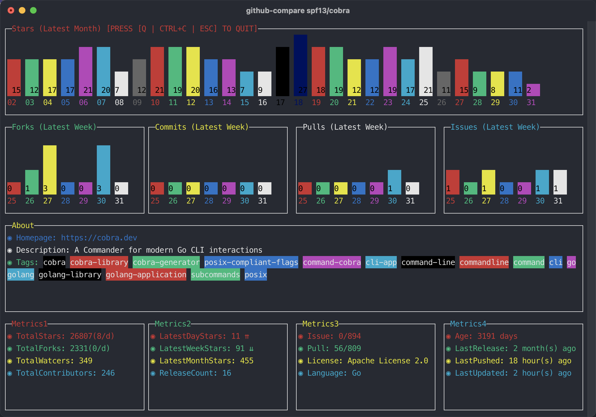
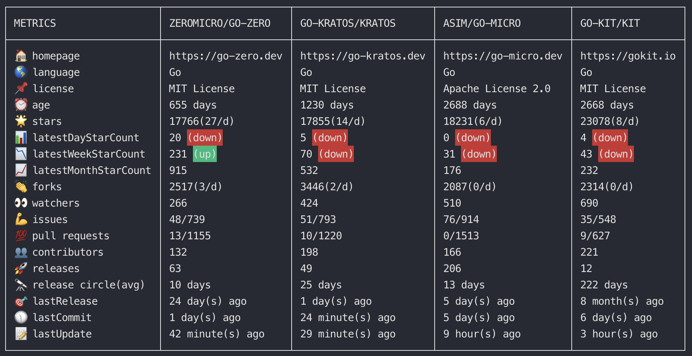

# github-compare

A GitHub repositories statistics command-line tool for the terminal

## Install

```bash
$ go install github.com/anqiansong/github-compare@latest
```

## Example

### TermUI-View

#### Single Repository

```bash
$ github-compare spf13/cobra
```



#### More than one Repository

```bash
$ github-compare spf13/cobra urfave/cli junegunn/fzf antonmedv/fx
```



### JSON-View

```bash
$ github-compare spf13/cobra --json                                           
[
  {
    "age": "3191 days",
    "avgReleasePeriod": "199 days",
    "contributorCount": "246",
    "forkCount": "2331(0/d)",
    "fullName": "spf13/cobra",
    "homepage": "https://cobra.dev",
    "issue": "0/893",
    "language": "Go",
    "lastPushedAt": "15 hour(s) ago",
    "latestReleaseAt": "2 month(s) ago",
    "lastUpdatedAt": "3 minute(s) ago",
    "latestDayStarCount": "13 ⇈",
    "latestMonthStarCount": "455",
    "latestWeekStarCount": "93 ⇊",
    "license": "Apache License 2.0",
    "pull": "56/809",
    "releaseCount": "16",
    "starCount": "26807(8/d)",
    "watcherCount": "349",
    "description": "A Commander for modern Go CLI interactions",
    ...
]
```
For details see [cobra.json](./resource/cobra.json)

### YAML-View

```bash
$ github-compare spf13/cobra --yaml                                           
- age: 3191 days
  avgreleaseperiod: 199 days
  contributorcount: "246"
  forkcount: 2331(0/d)
  fullname: spf13/cobra
  homepage: https://cobra.dev
  issue: 0/893
  language: Go
  lastpushedat: 15 hour(s) ago
  latestreleaseat: 2 month(s) ago
  lastupdatedat: 7 minute(s) ago
  latestdaystarcount: 13 ⇈
  latestmonthstarcount: "455"
  latestweekstarcount: 93 ⇊
  license: Apache License 2.0
  pull: 56/809
  releasecount: "16"
  starcount: 26807(8/d)
  watchercount: "349"
  description: A Commander for modern Go CLI interactions
  ...
```

For details see [cobra.yaml](./resource/cobra.yaml)

### Export as a csv file

```bash
$ github-compare spf13/cobra urfave/cli junegunn/fzf antonmedv/fx -f data.csv
```


## Usage

### Preparation

1. [Creating a personal access token](https://docs.github.com/en/authentication/keeping-your-account-and-data-secure/creating-a-personal-access-token)
2. Set access token token
    - Copied the access token and export to environment
    - Or you can set the access token by passing `github-compare` argument
      `--token`

### Execute

```bash
# set access token through the flag --token
# github-compare zeromicro/go-zero --token ${accessToken}
# or export access token to environment (recommended)
$ export GITHUB_ACCESS_TOKEN=${GITHUB_ACCESS_TOKEN}
$ github-compare zeromicro/go-zero
```

### Commands

```bash
$ github-compare -h                                                    
A GitHub repositories statistics command-line tool for the terminal

Usage:
  github-compare [flags]

Flags:
  -f, --file string    output to a specified file
  -h, --help           help for github-compare
      --json           print with json style
  -t, --token string   github access token
      --ui             print with term ui style(default) (default true)
  -v, --version        version for github-compare
      --yaml           print with yaml style
```

## Note

1. A GitHub personal access token is required.
2. `github-compare` accepts 1 to 4 repositories data queries.
3. If you prefer to export the access token to environment, you must use
   environment key `GITHUB_ACCESS_TOKEN`

## Last

If this repository can help you, give a star please!

Thanks all!

## License

[MIT License](License)